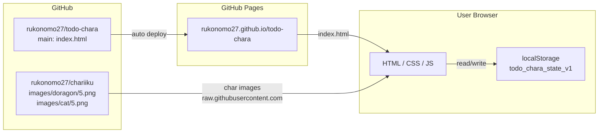

```mermaid
flowchart LR
    subgraph GitHub
        R1["rukonomo27/todo-chara\nmain: index.html"]
        R2["rukonomo27/chariiku\nimages/doragon/5.png\nimages/cat/5.png"]
    end

    subgraph GitHubPages["GitHub Pages"]
        GP["rukonomo27.github.io/todo-chara"]
    end

    subgraph Browser["User Browser"]
        BR["HTML / CSS / JS"]
        LS["localStorage\ntodo_chara_state_v1"]
    end

    R1 -- "auto deploy" --> GP
    GP -- "index.html" --> BR
    R2 -- "char images\nraw.githubusercontent.com" --> BR
    BR -- "read/write" --> LS
```
