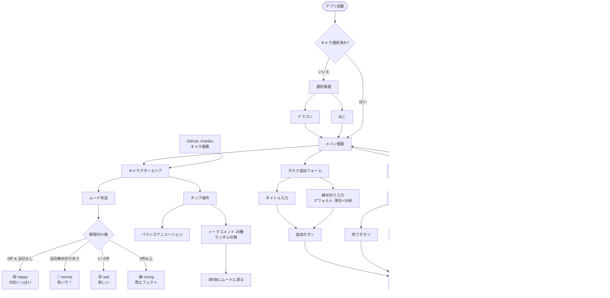

```mermaid
flowchart TD
    A([アプリ起動]) --> B{キャラ選択済み?}

    B -- いいえ --> C[選択画面]
    C --> C1[ドラゴン]
    C --> C2[ねこ]
    C1 & C2 --> D[メイン画面]

    B -- はい --> D

    D --> E[キャラクターエリア]
    D --> F[タスク追加フォーム]
    D --> G[タスクリスト]

    %% キャラクターエリア
    E --> E1[ムード判定]
    E1 --> E2{期限切れ数}
    E2 -- 0件 & 当日なし --> M1[😄 happy\n元気いっぱい]
    E2 -- 当日締め切りあり --> M2[😤 normal\n急いで！]
    E2 -- 1〜2件 --> M3[😢 sad\n悲しい]
    E2 -- 3件以上 --> M4[😭 crying\n雨エフェクト]

    E --> E3[タップ操作]
    E3 --> E3a[バウンスアニメーション]
    E3 --> E3b[トークコメント 20種\nランダム切替]
    E3b --> E3c[3秒後にムードに戻る]

    %% タスク追加
    F --> F1[タイトル入力]
    F --> F2[締め切り入力\nデフォルト: 現在+30秒]
    F1 & F2 --> F3[追加ボタン]
    F3 --> LS[(localStorage\ntodo_chara_state_v1)]

    %% タスクリスト
    G --> G1[タスクカード]
    G1 --> G2{状態}
    G2 -- 期限前 24h以上 --> S1[🔵 pending]
    G2 -- 期限前 24h以内 --> S2[🟡 soon]
    G2 -- 期限切れ --> S3[🔴 overdue]
    G2 -- 完了済み --> S4[🟢 completed]

    G1 --> G3[完了ボタン]
    G1 --> G4[削除ボタン]
    G3 & G4 --> LS

    %% データ永続化
    LS --> |読み込み| D

    %% 外部リソース
    EX[GitHub: chariiku\nキャラ画像] --> E
```
