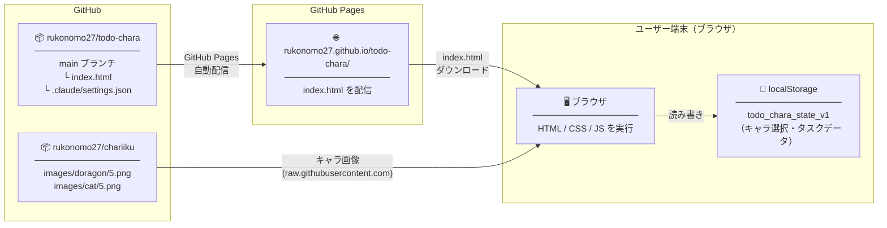

```mermaid
flowchart LR
    subgraph GitHub
        R1["📦 rukonomo27/todo-chara\n─────────────────\nmain ブランチ\n└ index.html\n└ .claude/settings.json"]
        R2["📦 rukonomo27/chariiku\n─────────────────\nimages/doragon/5.png\nimages/cat/5.png"]
    end

    subgraph "GitHub Pages"
        GP["🌐 rukonomo27.github.io/todo-chara/\n─────────────────\nindex.html を配信"]
    end

    subgraph "ユーザー端末（ブラウザ）"
        BR["🖥️ ブラウザ\n─────────────────\nHTML / CSS / JS を実行"]
        LS["💾 localStorage\n─────────────────\ntodo_chara_state_v1\n（キャラ選択・タスクデータ）"]
    end

    R1 -- "GitHub Pages\n自動配信" --> GP
    GP -- "index.html\nダウンロード" --> BR
    R2 -- "キャラ画像\n(raw.githubusercontent.com)" --> BR
    BR -- "読み書き" --> LS
```
